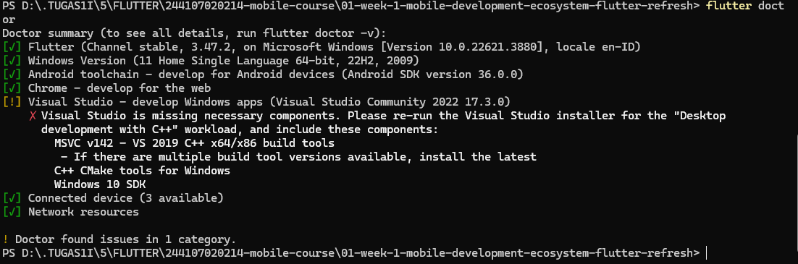
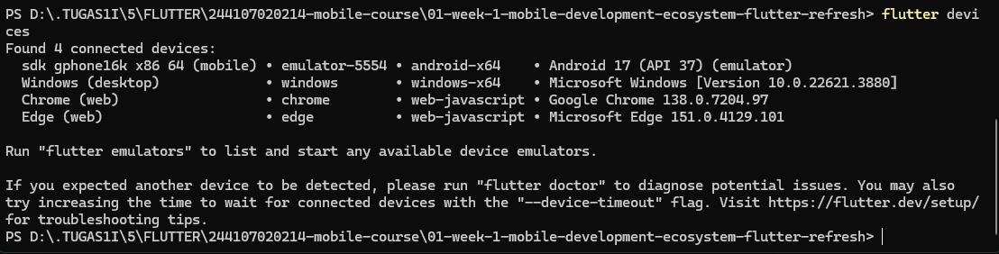
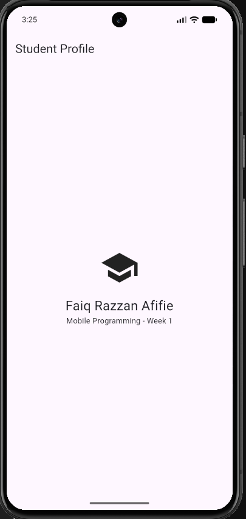
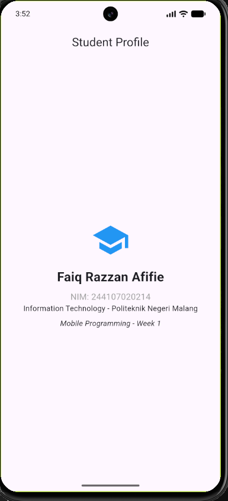

# Flutter Week 1 - Mobile Development Ecosystem

This project is a simple Flutter application created for the Week 1 mobile development practical lab and mini assignment.

## Checklist

- [x] Flutter doctor has no issue blocking the Android target.
- [x] Flutter devices detects an emulator or physical device.
- [x] The application runs and its default UI has been replaced with a simple profile.
- [x] You can explain the difference between hot reload and hot restart.
- [x] The remote repository contains source code, README, screenshots, and commit history.

## Project Description

This app displays a student profile page with:

- a school/profile icon
- student name & student ID (NIM)
- department & course information
- clean centered mobile layout

## Screenshots

### Flutter Doctor

### Flutter Devices

### Practical Lab Result

### Mini Assignment Result

## Hot Reload vs Hot Restart

- **Hot reload:** Injects updated code into the running Dart VM directly without losing the current app state.
- **Hot restart:** Rebuilds the app state from scratch and restarts the application life cycle.

## Setup Problem & Solution

- **Problem:** The week 1 folder turned into a nested git repository / submodule on GitHub (grey folder icon that couldn't be opened) due to an accidental `.git` folder inside the subfolder.
- **Solution:** Removed the inner `.git` folder, cleared the git cache using `git rm -r --cached`, and recommitted from the root directory.

## Reflection

- **When is native development more appropriate than cross-platform development?**
  When the app requires heavy graphic performance (e.g. 3D games), deep access to specialized hardware sensors, or immediate adoption of the latest platform-specific OS APIs.

- **How does a state change relate to the widget tree and declarative UI?**
  In Flutter's declarative UI ($UI = f(state)$), any state change triggers a rebuild of the affected widget subtree so that the UI reflects the latest data state efficiently.

- **Why are small commits with clear messages useful for teamwork and a portfolio?**
  They make code review and bug tracking easier during collaboration, minimize merge conflicts, and present a structured development progress in a professional portfolio.
