# Flutter Week 2 - Declarative UI

In a declarative approach, code describes the interface based on the current state. When state changes, Flutter rebuilds the relevant UI. Developers focus on the relationship between data and presentation instead of manually changing each UI element.

## Verification Checklist

- [x] flutter analyze produces no errors.
- [x] flutter test passes all responsive widget tests.
- [x] The application runs at narrow and wide screen sizes.
- [x] Dark mode has sufficient contrast and readable text.
- [x] The widget structure can be explained during code review.
- [x] Screenshots, the test/ folder, and README are stored in the Week 2 assignment folder.

## Practical lab: responsive dashboard Result

**Simple-Profile**

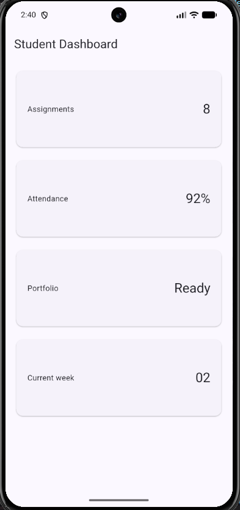 | 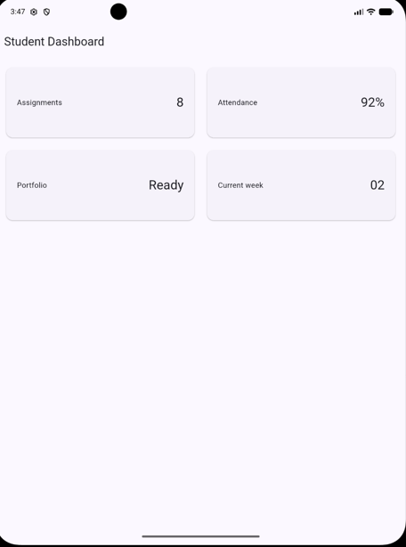

**Adding interaction: StatefulWidget and Cupertino**

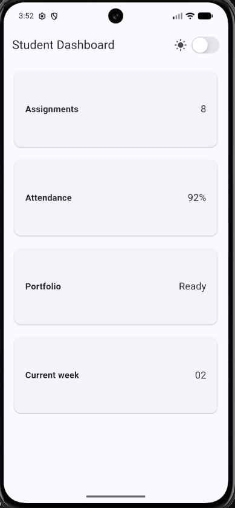 | 

**Layout experiments**

1. Change the 700 breakpoint and observe the column count.

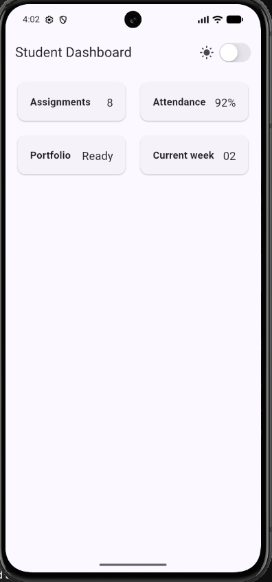 | 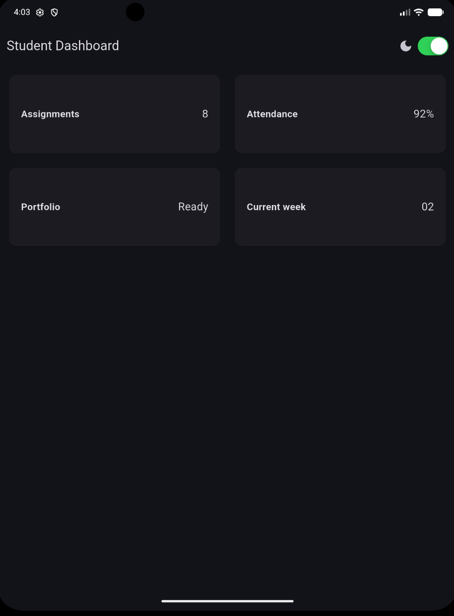

Setting the breakpoint to 400 forces standard mobile screens into a crowded 2-column grid prematurely, significantly reducing the horizontal space for each dashboard card.

2. Change themeMode to ThemeMode.dark, then restore ThemeMode.system.
3. Test the application at different emulator screen sizes.
4. Add Semantics or meaningful labels to important screen-reader elements.

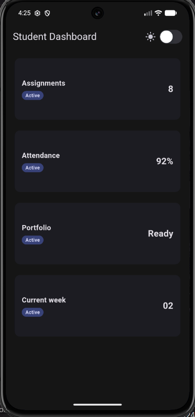 | 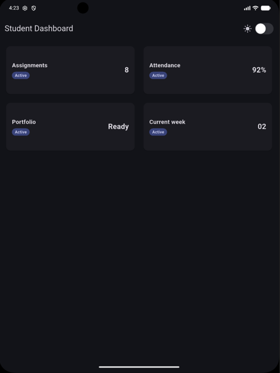

- **Theme Mode:** Hardcoding `ThemeMode.dark` permanently locks the app into dark mode regardless of switch toggles until restored to dynamic state.
- **Screen Size Testing:** Verified responsive behavior across different emulator sizes, seamlessly transitioning from 1 column on mobile (< 700px) to 2 columns on tablet viewports (>= 700px).
- **Semantics & Labels:** Added visible status badges to cards and wrapped both cards and the `CupertinoSwitch` with `Semantics` for complete screen-reader accessibility.

## Main Assignment

**Extend the dashboard into an Academic Overview page:**

- Include a profile header and at least four information cards.
- Use Row, Column, Expanded, and Container.
- Show one column on narrow screens and two columns on wide screens.
- Provide readable light and dark themes, with a theme toggle (e.g. a CupertinoSwitch or Switch.adaptive).
- Add accessibility labels for important information or buttons.
- Include narrow- and wide-screen screenshots in screenshots/.

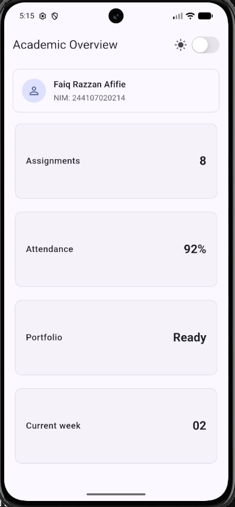 | 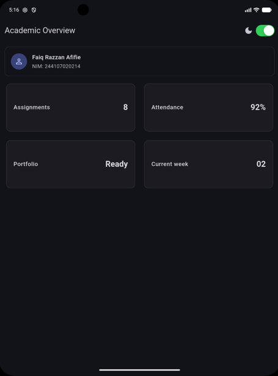

## AI Prompt Challenge

### 1. Design Comparison: GridView vs Column/Row

- **Selected Approach:** `Expanded` wrapping `LayoutBuilder` + `GridView.count`.
- **Trade-offs:**
  - `GridView.count` minimizes boilerplate code and handles internal grid spacing cleanly across breakpoints (`columns = 1` on mobile, `columns = 2` on tablet).
  - The trade-off is relying on a static `childAspectRatio: 2.6`, which requires cards to maintain uniform height, whereas a `Column` + `Row` structure would adapt dynamically to varying content heights.

### 2. Expanded Behavior inside Row

- In the profile banner, `Expanded` is critical around the text `Column` to prevent horizontal render overflow when displaying longer names alongside the `CircleAvatar`.
- An `Expanded` would cause an unbound constraint error if paired with horizontally scrollable children without explicit dimensions, which was intentionally avoided here.

### 3. Verification & Accessibility Audit

- **Viewport Safety (< 600px):** The layout safely collapses to a single column on compact screens without horizontal clipping.
- **Accessibility:** Verified that `Semantics` wrappers remain intact and properly announce card contents (`title` and `value`) and switch states to assistive screen readers.

## Refactoring challenge

Once the main assignment works, clean up your code:

1.  Extract the information card into a reusable widget (e.g. InfoCard) that receives title and value, removing widget duplication.
2.  Replace hardcoded colors and sizes with Theme.of(context) so they follow the light/dark theme automatically.
3.  Move the breakpoint into a single named constant (e.g. const kWideBreakpoint = 700;) so it is defined only once.

    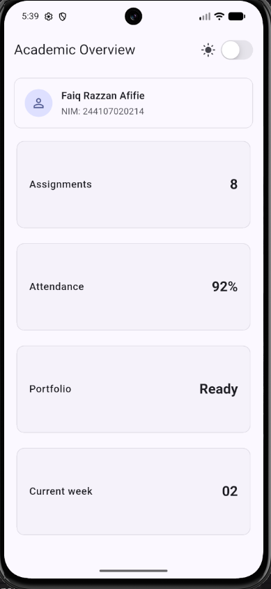 | 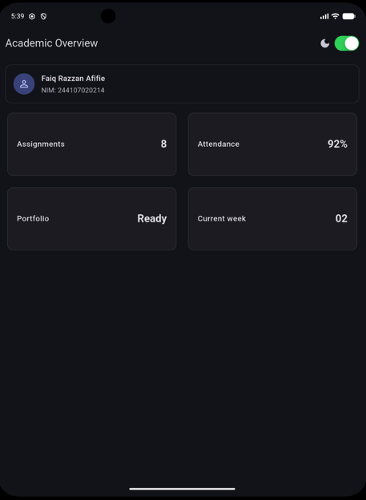

4.  Run flutter analyze and ensure there are no new errors or warnings.

    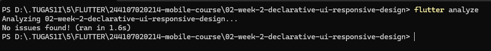

## Basic Testing

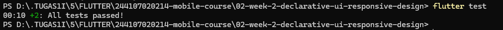

## Reflection

- **How does imperative thinking differ from declarative thinking when building UI?**
  `Imperative manually manipulates UI elements step-by-step (button.setColor()), while declarative describes the UI as a reflection of the current state and lets Flutter rebuild the widget tree automatically.`
- **When does Expanded help, and when can it cause a layout error?**
  `Expanded distributes remaining space and prevents text overflows inside a flex container (Row or Column), but it triggers layout crashes (unbounded constraints) when placed inside parents without finite boundaries along the flex axis, such as an unconstrained ListView.`
- **How do breakpoints and themes affect user experience?**
  `Breakpoints prevent cramped layouts on small screens and excess whitespace on large screens, while themes ensure proper text contrast and reading comfort across different lighting environments.`
- **What did you verify after receiving an AI design recommendation?**
  `Verified responsiveness without overflow below 600px, checked that Semantics tags remained intact for screen readers, and ensured the code used current stable APIs (replacing deprecated withOpacity with withValues).`
