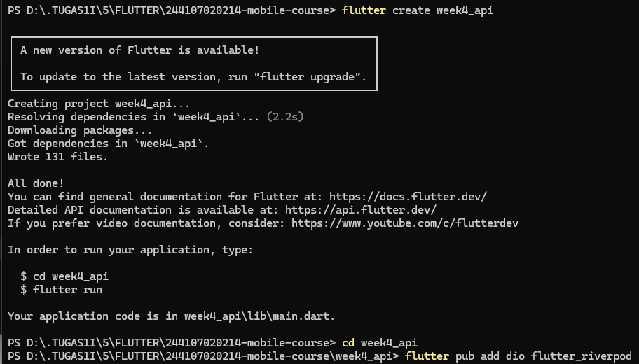
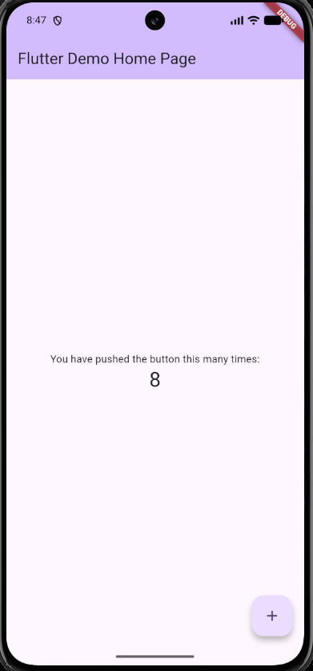
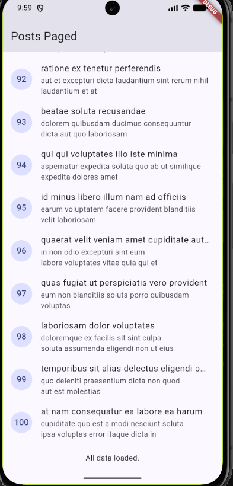
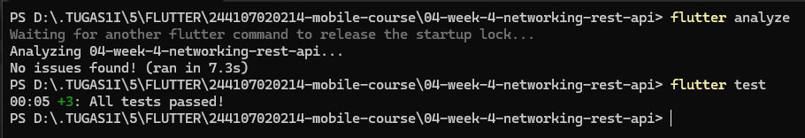
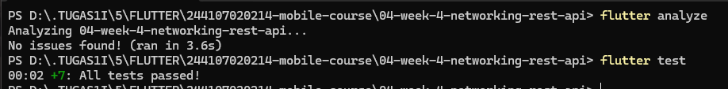

# Flutter Week 4 - Networking & REST API

Integrate HTTP, Dio, JSON, data models, repositories, and API error handling.

---

## 1. Lab 1: Dio & Data Models

### Project Setup

Initialization of dependencies, project structure, and centralized Dio client configuration.

### Result Output

Initial data fetch verification using model deserialization and Dio HTTP client.

---

## 2. Lab 2: Provider & Error Handling

Verification of reactive UI states and network failure recovery scenarios:

### Scenario 1: Normal Internet Connectivity

The application initially enters the loading state and renders a `CircularProgressIndicator` in the center of the screen. Once the asynchronous request resolves successfully, the UI transitions to the success state and renders all 100 posts inside a `ListView.builder`. Each entry cleanly displays its ID inside a `CircleAvatar`, along with truncated titles and descriptions.

### Scenario 2: Airplane Mode & Retry Flow

Enabling Airplane Mode cuts off network connectivity. Tapping the refresh action causes Dio to throw a `connectionError`, which is trapped and mapped to the user-friendly string _"Cannot reach the server. Check your internet connection."_ alongside a functional Retry button. Toggling the network back on and clicking Retry invalidates the provider and successfully re-renders the post list.

### Scenario 3: Unreachable Host / Invalid Base URL

Pointing `baseUrl` to an unreachable or invalid host triggers a DNS lookup or connection failure in Dio. The application catches the resulting `connectionError` and safely renders the fallback UI (_"Cannot reach the server. Check your internet connection."_) without throwing an unhandled exception or breaking the UI flow. Once `baseUrl` is restored, the posts reload as expected.

---

## 3. Lab 3: Basic Pagination

### 1. Initial Page Load

On initial launch, the notifier executes `Future.microtask(loadFirstPage)` and retrieves only the first page with a limit of 10 items via query parameters `_page=1&_limit=10`. The UI immediately renders items with IDs 1 to 10 inside the `ListView.builder` instead of fetching the entire 100-post dataset at once.

### 2. Infinite Scrolling & Data Growth

As the scroll position reaches within 200 pixels of `maxScrollExtent`, the `ScrollController` listener triggers `loadNextPage()`. The guard clause `if (state.isLoadingMore || !state.hasMore) return;` prevents redundant concurrent requests. The repository fetches the next page, and the notifier merges the new records with the existing list (`[...currentItems, ...items]`), expanding the list smoothly without re-rendering or reloading previous items.

### 3. End-of-Data Indicator

When the endpoint returns fewer items than the requested limit (`items.length == 10` evaluates to `false`), `hasMore` is set to `false`. The bottom list item detects `!state.hasMore` and displays the completion message _"All data loaded."_, ensuring no further network requests are dispatched.

---

## 4. AI Challenge

### Prompt Executed

Create a Flutter repository layer for the GET /comments?postId={id}
endpoint of JSONPlaceholder using Dio + flutter_riverpod.
Requirements:

- Comment model with null-safe fromJson (postId, id, name, email, body).
- CommentRepository with fetchComments(postId) + 10-second timeout.
- AsyncNotifierProvider with automatic error handling (AsyncError)
  and a user-friendly error-message function for timeout,
  connection error, 404, and 500.
- One unit test for fromJson with missing fields.
  Explain each part of the code with comments.

### AI Verification Checklist & Remediation Findings

Based on the codelab's AI verification checklist, an independent evaluation and remediation were conducted:

- **Layer Separation:** The UI does not access Dio directly. All network requests are strictly isolated inside `CommentRepository`, which is injected via Riverpod's `commentRepositoryProvider`.
- **Null-Safety & Defensive Parsing:** The `Comment.fromJson` model avoids direct non-nullable casts (`as int`) and instead implements safe default fallbacks (`?? 0` and `?? ''`), preventing runtime crashes when dealing with null values or missing fields.
- **Centralized Error Handling:** The `friendlyCommentError` function properly maps all required `DioExceptionType` scenarios (`timeout`, `connectionError`, and `badResponse` with status codes 404 and $\ge 500$) into user-friendly error messages.
- **Riverpod Notifier Refactoring:** The AI-generated notifier class structure was refactored from invalid generic bounds into a standard `AsyncNotifier<List<Comment>>` utilizing `AsyncValue.guard()` for reliable asynchronous state management.
- **Edge-Case Unit Testing:** Unit tests in `test/comment_model_test.dart` were expanded beyond the happy path to verify resilience against missing JSON fields as well as explicit `null` attributes.

### Verification Evidence (Test & Analyze)

Static code analysis and unit test suite execution completed successfully without warnings or failures:

## 5. Refactoring & Testing

### Refactoring Challenge

- **Widget Extraction (`lib/widgets/post_tile.dart`):** Extracted post rows into an isolated, reusable `PostTile` widget to keep list builders compact and independently testable.
- **Modular Error Handling (`lib/data/network_errors.dart`):** Decoupled `friendlyErrorMessage` into a standalone module re-exported by `lib/data/providers.dart`.
- **State Access Helpers (`lib/data/providers.dart`):** Added synchronous reading utilities (`readPostsOnce` and `readPostsErrorOnce`) for robust unit testing.

### Unit Tests with Fake Repository

Implemented `test/post_test.dart` using a test double (`FakePostRepository`) to verify logic without making real HTTP network calls:

1. **Model Robustness:** Confirms `Post.fromJson` handles incomplete JSON objects without exceptions.
2. **Error Translation:** Asserts `friendlyErrorMessage` correctly describes connection errors.
3. **Provider Data Delivery:** Validates that the provider delivers expected mock datasets through Riverpod.
4. **Provider Error Propagation:** Verifies that repository exceptions are correctly captured and handled by the provider container.

### Verification Evidence (Test & Analyze)

The refactored code and test suites ran successfully with zero warnings and all tests passing:

## 6. Self-Verification Checklist

Evaluation against the final codelab requirements:

- [x] **No Direct Dio Calls:** All data fetching routes strictly through repository classes and Riverpod providers.
- [x] **Four States Handled:** Loading, Error (+ Retry), Empty, and Success states are fully supported.
- [x] **Safe Pagination:** Data appends smoothly on scroll, prevents duplicate triggers, and features a terminal end-of-data indicator.
- [x] **Clean Analysis & Tests:** `flutter analyze` reports zero issues and all automated tests pass.
- [x] **Documented AI Output:** AI outputs, findings, and remediations are verified and documented in `README.md` and the `docs/` directory.

## 7. Reflection

- **Why is the UI forbidden from calling Dio directly? What breaks if this rule is violated?**
  It violates the principle of _Separation of Concerns_. If the UI calls Dio directly, the widgets become tightly coupled with low-level HTTP details. Widget testing also becomes much more difficult because HTTP requests have to be mocked directly. It can also lead to duplicated data-parsing and error-handling logic across multiple widgets.

- **When is client-side pagination enough, and when must you rely on server pagination (`_page` / `_limit`)?**
  Client-side pagination is sufficient when the total amount of data is relatively small, static, and can be fetched into memory at once, such as dozens of items. On the other hand, server-side pagination should be used when the data contains hundreds or thousands of items or changes dynamically. This helps reduce memory usage on the device, save network bandwidth, and keep the application's initial loading time responsive.

- **How do repository exceptions become `AsyncError` without try/catch in every widget? When is explicit try/catch still needed?**
  Riverpod (`FutureProvider` and `AsyncNotifierProvider`) automatically catches asynchronous exceptions inside their execution functions and converts the provider's state into an `AsyncValue.error`, similar to using `AsyncValue.guard()`. Therefore, widgets can simply read the state declaratively using `.when(data: ..., loading: ..., error: ...)`. Explicit `try/catch` is still needed for imperative user actions, such as submitting a form, deleting data, or confirming an action in a dialog, when an error needs to be displayed immediately through contextual UI feedback such as a `SnackBar` without rebuilding or replacing the entire page.

- **Which part of the AI output did you fix, and why?**

  1. **Null-Safety & Defensive Parsing:** I replaced direct casts (`as int`) with safe fallback values (`?? 0` and `?? ''`) in `fromJson` so that the application does not crash when a field is null or missing from the JSON.
  2. **Riverpod Provider Structure:** I corrected the invalid generic parameter structure generated by the AI into the standard `AsyncNotifier<List<Comment>>` structure and used `AsyncValue.guard()` for proper asynchronous error handling.
  3. **Test Coverage:** I expanded the unit test coverage to test not only normal data but also parsing scenarios where keys are missing or explicitly contain null values.
