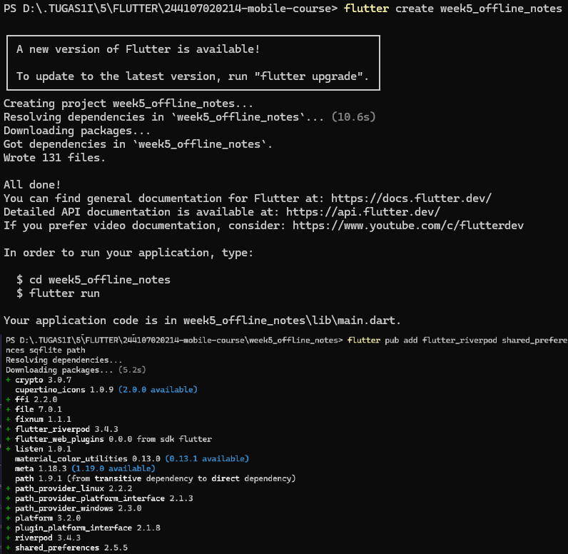
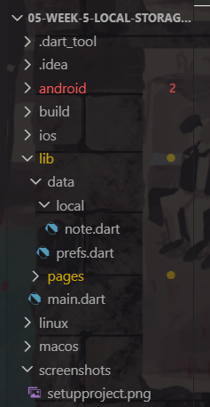
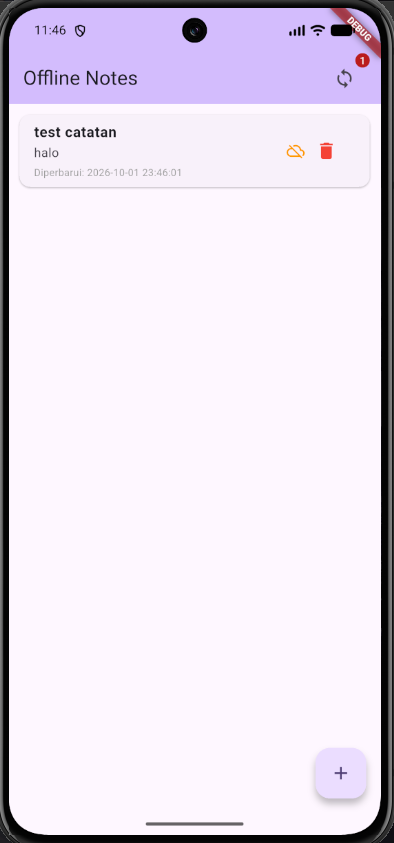
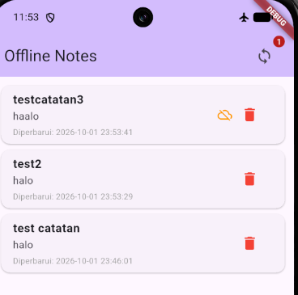
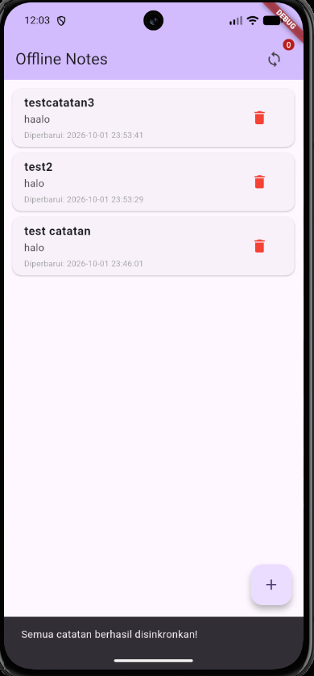
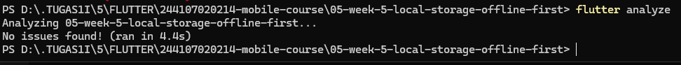

# Flutter Week 5 — Local Storage & Offline-First Architecture

This repository demonstrates local data persistence, caching mechanisms, sync queues, and offline-first design patterns in Flutter.

## Table of Contents

1. [Lab 1: Key-Value Persistence with SharedPreferences](#1-lab-1-key-value-persistence-with-sharedpreferences)
2. [Lab 2: Relational Local Storage with SQLite](#2-lab-2-relational-local-storage-with-sqlite)
3. [Lab 3: Cache-First Strategy & Sync Queue](#3-lab-3-cache-first-strategy--sync-queue)
4. [AI Challenge & Storage Engine Comparison](#4-ai-challenge--storage-engine-comparison)
5. [Refactoring, Testing, and Verification](#5-refactoring-testing-and-verification)
6. [Self-Verification Checklist](#6-self-verification-checklist)
7. [Reflection](#7-reflection)

---

## 1. Lab 1: Key-Value Persistence with SharedPreferences

Demonstrates light data persistence for user settings and lightweight application preferences using `shared_preferences`.

### Project Setup



### Folder Structure



---

## 2. Lab 2: Relational Local Storage with SQLite

Implements robust local storage using SQLite via `sqflite`. Features structured data management and repository pattern architecture for handling offline note CRUD operations.

### Output



---

## 3. Lab 3: Cache-First Strategy & Sync Queue

Demonstrates an offline-first architecture using a **Cache-First Strategy** alongside a **Sync Queue mechanism**:

- **Cache-First Reads** — Instantly renders cached API responses locally while refreshing updated data in the background.
- **Dirty State Tracking & Sync Queue** — Tracks unsynced local mutations (marked as dirty) during offline mode (e.g., Airplane Mode) and batches them for server synchronization when network connectivity is restored.

### Output

**Before Sync:**



**After Sync:**



### Observations

- **Before Sync (Offline):** Creating notes in Airplane Mode flags them locally (`dirty = 1`), displaying an offline icon on the note and incrementing the sync badge counter.
- **After Sync (Online):** Reconnecting and tapping the sync button triggers `syncNotes()`, updating records to `dirty = 0`, removing the offline icons, and resetting the badge counter to 0.

---

## 4. AI Challenge & Storage Engine Comparison

### Comparison Matrix: Local Storage Engines in Flutter

| Storage Engine        | Query Complexity                    | Relational Needs             | Reactivity (Streams)                        | Type Safety                               | Boilerplate Size                                     | Testability                                                   |
| --------------------- | ----------------------------------- | ---------------------------- | ------------------------------------------- | ----------------------------------------- | ---------------------------------------------------- | ------------------------------------------------------------- |
| **SharedPreferences** | Very Low (Key-Value only)           | None (No tables/relations)   | Manual / `ValueNotifier`                    | Low (Key-based dynamic casting)           | Very Low                                             | High (Mockable via `setMockInitialValues`)                    |
| **Hive**              | Low–Medium (Key-Value / Indexes)    | Poor (Manual object nesting) | Built-in (`ValueListenable`)                | Medium (Requires TypeAdapters/Generators) | Low–Medium                                           | High (In-memory boxes for unit tests)                         |
| **sqflite**           | High (Raw SQL queries, JOINs)       | High (Foreign keys, indexes) | Manual (Requires custom `StreamController`) | Low–Medium (Map-based conversion)         | Medium                                               | Medium (Requires `sqflite_common_ffi` for desktop unit tests) |
| **Drift**             | High (Type-safe SQL queries, JOINs) | High (First-class relations) | Built-in Native Streams (`watch()`)         | High (Compile-time code generation)       | High (Requires `build_runner` and schema migrations) | High (Native in-memory SQLite support)                        |

### Final Storage Recommendations

| Storage Need          | Recommended Engine         | Justification                                                                                                                                                       |
| --------------------- | -------------------------- | ------------------------------------------------------------------------------------------------------------------------------------------------------------------- |
| **Theme Preferences** | **SharedPreferences**      | Ideal for simple key-value pairs (e.g., `is_dark_mode`). Near-zero overhead, fast synchronous read performance on startup, and no database schema overhead.         |
| **Notes Management**  | **sqflite** (or **Drift**) | Notes require relational query capabilities, indexing for offline search, and specific schema columns (`updated_at`, `dirty` flag) to manage an offline sync queue. |

### Schema Definitions (Supporting 1000+ Notes with Offline Sync Queue)

#### SQLite Schema (`sqflite`)

```sql
CREATE TABLE notes (
    id INTEGER PRIMARY KEY AUTOINCREMENT,
    title TEXT NOT NULL,
    body TEXT NOT NULL DEFAULT '',
    updated_at TEXT NOT NULL,
    dirty INTEGER NOT NULL DEFAULT 0 -- 1: Pending Sync Queue, 0: Synced
);

-- Indexes to optimize querying unsynced records and sorting 1000+ notes
CREATE INDEX idx_notes_dirty ON notes(dirty);
CREATE INDEX idx_notes_updated_at ON notes(updated_at DESC);
```

#### Hive Schema (`NoteAdapter`)

```dart
import 'package:hive/hive.dart';

part 'note.g.dart';

@HiveType(typeId: 0)
class NoteHiveModel extends HiveObject {
  @HiveField(0)
  final int id;

  @HiveField(1)
  final String title;

  @HiveField(2)
  final String body;

  @HiveField(3)
  final DateTime updatedAt;

  @HiveField(4)
  final bool dirty; // Sync Queue Flag

  NoteHiveModel({
    required this.id,
    required this.title,
    required this.body,
    required this.updatedAt,
    required this.dirty,
  });
}
```

### Trade-off Analysis

- **SharedPreferences** — Extremely lightweight for simple key-value settings, but fragile and slow when serializing complex object collections.
- **Hive** — Blazing fast for NoSQL operations with built-in reactivity, but lacks native relational queries and indexing needed for complex filtering across 1000+ notes.
- **sqflite** — Excellent for standard SQL operations, batching, and indexing without code generators, but requires manual type conversion and stream controllers.
- **Drift** — Combines type-safety and native stream support with full SQLite capabilities, but incurs heavy boilerplate and code generator dependencies.

### AI Verification Checklist Findings

- **Collection Handling** — The AI correctly rejected placing complex note collections in `SharedPreferences`, reserving it strictly for simple theme key-value pairs.
- **Sync Queue Support** — The generated schema includes explicit `updated_at` and `dirty` flag columns to manage local offline mutation states.
- **Reactivity Claims** — Confirmed that native stream support (`watch()`) is a feature of Drift, whereas `sqflite` requires manual stream updates.
- **Boilerplate & Friction** — Verified that `sqflite` setup is lightweight via `flutter pub add sqflite path`, while Drift introduces additional overhead due to code generation (`build_runner`).
- **Final Architectural Decision** — Selected **SharedPreferences** for user theme settings (lightweight) combined with **sqflite** for notes and offline sync queue management (relational stability without generator overhead).

---

## 5. Refactoring, Testing, and Verification

### Flutter Test


### Flutter Analyze



---

## 6. Self-Verification Checklist

| Checklist Item                   | Status  | Verification Notes                                                                                                         |
| -------------------------------- | ------- | -------------------------------------------------------------------------------------------------------------------------- |
| **Strict Architecture Layering** | ✅ Pass | The UI never calls SQLite or SharedPreferences directly; all operations strictly pass through `Repository` and `Provider`. |
| **Airplane Mode Capability**     | ✅ Pass | App fully functions offline: notes can be read, created, and deleted seamlessly.                                           |
| **Data Sync & Dirty Badging**    | ✅ Pass | Dirty badges update accurately before/after synchronization; cached posts render gracefully in offline mode.               |
| **Code Quality & Test Suite**    | ✅ Pass | `flutter analyze` returns 0 issues; all unit and widget tests pass (`flutter test`).                                       |
| **AI Output Documentation**      | ✅ Pass | AI verification outputs, prompt workflows, and architectural logs are fully documented in the `docs/` folder.              |

---

## 7. Reflection

### 1. Why must the note list not be stored in `SharedPreferences`? What breaks if this rule is violated?

`SharedPreferences` is designed for key-value pairs (e.g., app configuration, themes, or timestamps). Storing structured data like a list of notes requires serializing and deserializing large JSON strings, which runs synchronously on the main UI thread.

If this rule is violated:

- **Performance Degradation** — Updating a single note forces the entire dataset to be parsed and re-written to disk, causing UI stutter (_jank_).
- **Lack of Query Capabilities** — You lose indexing, native sorting (`ORDER BY updated_at DESC`), search, and pagination.
- **Data Corruption** — It lacks ACID transactions. An app crash mid-write can corrupt the entire JSON string.

### 2. When is cache-first enough, and when do you need another strategy (e.g., network-first for real-time prices)?

- **Cache-First is sufficient when** — Working with user-generated local content (e.g., offline notes, drafts, or personal to-do lists) where immediate UI response and offline access take priority over instant multi-device sync.
- **Network-First is required when** — Data accuracy is time-critical or financially sensitive (e.g., stock market prices, cryptocurrency rates, flight seat availability, or payment transactions). Serving stale cached data in these contexts could lead to incorrect user decisions or failed transactions.

### 3. How does a dirty flag become a sync queue without blocking the UI? When does a separate queue (outbox table) become necessary?

- **Dirty Flag as Sync Queue** — When a user creates or modifies a note, it is immediately written to SQLite with `dirty = 1`. Riverpod updates the UI instantaneously without waiting for a network response. A background sync process queries `SELECT * FROM notes WHERE dirty = 1`, sends the payload to the server, and sets `dirty = 0` upon success.
- **When an Outbox Table is necessary** — When the **order of operations** (e.g., Create → Update → Delete on the same item) matters. A simple dirty flag only stores the final state of an entity, whereas an outbox table logs discrete mutation events in chronological order for complex retry logic.

### 4. Which part of the AI recommendation did you reject, and why?

- **Rejected Recommendation** — The AI initially suggested awaiting the network sync completion directly inside the UI write methods, as well as returning `provider.future` directly during async error handling in unit tests.
- **Reason for Rejection** — Awaiting network responses breaks the offline-first principle by causing UI hangs when the device has poor or no connection. Instead, local SQLite writes occur synchronously/instantly, and sync runs decoupled in the background. For unit tests, listening to provider state changes directly prevented Riverpod `TimeoutException` issues caused by internal retries on `.future`.
